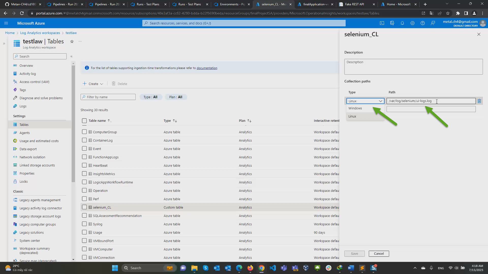

[](https://dev.azure.com/metalch4/final_project/_build/latest?definitionId=17&branchName=main)

# Table of Contents - Ensuring Quality Releases

- **[Overview](#Overview)**
- **[Dependencies](#Dependencies)**
- **[Azure Resources](#Azure-Resources)**
- **[Installation Configuration Steps](#Installation-Configuration-Steps)**
- **[Monitoring And Logging Result](#Monitoring-And-Logging-Result)**
- **[Clean Up](#Clean-Up)**

## Overview

This project demonstrates how to ensure quality releases using Azure cloud through the implementation of automated testing, performance monitoring and logging using Azure DevOps, Apache JMeter, Selenium, Postman and Terraform.

* To use  a variety of industry leading tools, especially Microsoft Azure, to create disposable test environments and run a variety of automated tests with the click of a button.


## Dependencies
| Dependency | Link |
| ------ | ------ |
| Terraform | https://www.terraform.io/downloads.html |
| JMeter |  https://jmeter.apache.org/download_jmeter.cgi|
| Postman | https://www.postman.com/downloads/ |
| Python | https://www.python.org/downloads/ |
| Selenium | https://sites.google.com/a/chromium.org/chromedriver/getting-started |
| Azure DevOps | https://azure.microsoft.com/en-us/services/devops/ |

## Azure Resources
 - Azure account  
 - Azure Storage account (resource)
 - Azure Log Workspace (resource)
 - Terraform Service principle (resource)
 - Azure CLI (resource)

## Installation Configuration Steps
### Terraform in Azure
1. Clone source repo
2. Open a Terminal in VS Code and connect to your Azure Account and get the Subscription ID

```bash
az login 
az account list --output table
```

3. Configure storage account to Store Terraform state

  Execute the script **terraform/commands.sh** :

  ```bash
  ./commands.sh
  ```

  * Take notes of **storage_account_name**, **container_name**, **access_key** . They are will be used in **main.tf** terrafrom files

  ```bash
  backend "azurerm" {
    storage_account_name = "tfstate268179373"
    container_name       = "tfstate"
    key                  = "key1"
    access_key           = "your_access_key"
  }
  ```


### Create a Service Principal for Terraform
1. Create a  Service Principal with **Contributor** role, performing the following steps:

```bash
az ad sp create-for-rbac --role Contributor --scopes /subscriptions/<your-subscription-id> --query "{ client_id: appId, client_secret: password, tenant_id: tenant }" 
```

  * Take notes of **appId**, **password**, and **tenant** as will be used at **terraform/terraform.tfvars** file 


2. On your terminal create a SSH key and also perform a keyscan of your github to get the known hosts.

  ```bash
  ssh-keygen -t rsa
  cat ~/.ssh/authorizekeys/id_rsa.pub
  ```

### Azure DevOps
1. Login to Azure DevOPs and perform the following settings before to execute the Pipeline. 

2. Install these Extensions :

  * JMeter (https://marketplace.visualstudio.com/items?itemName=AlexandreGattiker.jmeter-tasks&targetId=625be685-7d04-4b91-8e92-0a3f91f6c3ac&utm_source=vstsproduct&utm_medium=ExtHubManageList)
    
  * PublishHTMLReports (https://marketplace.visualstudio.com/items?itemName=LakshayKaushik.PublishHTMLReports&targetId=625be685-7d04-4b91-8e92-0a3f91f6c3ac&utm_source=vstsproduct&utm_medium=ExtHubManageList)

  * Terraform (https://marketplace.visualstudio.com/items?itemName=ms-devlabs.custom-terraform-tasks&targetId=625be685-7d04-4b91-8e92-0a3f91f6c3ac&utm_source=vstsproduct&utm_medium=ExtHubManageList)

3. Create a Project into your Organization

4. Create the Service Connection in Project Settings > Pipelines > Service Connection

     <br/>
 
5. Create a New Pipeline in your Azure DevOPs Project
  - Located at GitHub
  - Select your Repository
  - Existing Azure Pipelines YAML file
  - Choosing **azure-pipelines.yaml** file

    5.1. Tab Pipelines -> Create Pipeline -> Where is your code? Choose Github (Yaml) -> Select Repo -> Configure your pipeline
    : Choose "Existing Azure Pipelines yaml file" > Continue > Run <br/>
       <br/>

       <br/>

    5.2. Apcept permission for Azure Resources Create with terraform <br/>
       <br/>

       <br/>


6. Wait the Pipeline is going to execute on the following Stages:

    Azure Resources Create --> Archive files --> Deploy App --> Test

    

### Configure Logging for the VM in the Azure Portal
1. Create a Log Analytics Workspace.

    

2. Set up email alerts in the App Service:
 
 * Log into Azure portal and go to the AppService that you have created.
 * On the left-hand side, under Monitoring, click Alerts, then New Alert Rule.
 * Verify the resource is correct, then, click “Add a Condition” and choose Http 4xx
 * Then, set the Threshold value of 1. Then click Done
 * After that, create an action group and name it testag.
 * Then, add “Send Email” for the Action Name, and choose Email/SMS/Push/Voice for the action type, and enter your email. Click OK
 * Name the alert rule HTTP 4xx errors found are greater than 1, and leave the severity at 3, then click “Create”
  Wait ten minutes for the alert to take effect. If you then visit the URL of the app service and try to go to a non-existent page more than once it should trigger the email alert.

3. Log Analytics
  * Go to the `App service* Diagnostic Settings > + Add Diagnostic Setting`. Tick `AppServiceHTTPLogs` and Send to Log Analytics Workspace created on step above and  `Save`. 

  * Go back to the `App service > App Service Logs `. Turn on `Detailed Error Messages` and `Failed Request Tracing` > `Save`. 
  * Restart the app service.

4. Set up log analytics workspace properly to get logs:

  * Go to Virtual Machines and Connect the VM created on Terraform to the Workspace ( Connect). Just wait that shows `Connected`.

    * Set up custom logging , in the log analytics workspace go to Tables > Creates > New Custom Log (MMA Base) Choose File. Select the file ui-logs.log > Next > Next. Put in the following paths as type Linux:

    /var/log/selenium/ui-logs.log

    Give it a name ( `selenium_CL`) and click Done. Tick the box Apply below configuration to my linux machines.
  
  
  * Go to the App Service web page and navigate on the links and also generate 404 not found , example:

    ```html
    [https://finalapplication-appservice.azurewebsites.net/](https://finalapplication-appservice.azurewebsites.net/)

    [https://finalapplication-appservice.azurewebsites.net/demo](https://finalapplication-appservice.azurewebsites.net/demo)  (F5 several times to trigger the alert condition)
    ```

  * After some minutes ( 3 to 10 minutes) , check the email configured since an alert message will be received. and also check the Log Analytics Logs , so you can get visualize the logs and analyze with more detail.

  


## Monitoring And Logging Result
Configure Azure Log Analytics to consume and aggregate custom application events in order to discover root causes of operational faults, and subsequently address them.

### Environment Creation & Deployment
  #### The pipeline build results page
  

  #### Terraform Installation
  
  
  #### Terraform Init
  

  #### Terraform Validate
  

    #### Terraform Apply
   <br>

   <br>

### Archive Packages
  

  
  
  

  
  

### Deploy App

  #### FakeRestAPI
  

  


### Automated Testing


  #### JMeter log output
  

  

  #### JMeter Publish Result                                                                 
  

  

  

  

  #### Postman Regression Tests
  

  

  

  #### Postman Data Validation Tests
  

  

  

  #### Selenium
  

  

  
  #### The artifact is downloaded from the Azure DevOps and available under the /artifacts folder.


### Monitoring & Observability

  #### Alert Rule:
  

  


  #### Fired Alert:
  

  

  #### Logs from Azure Log Analytics
    
    Go to Log Analytics Workspace , to run the  following queries:

    ```kusto
    AppServiceHTTPLogs
    | where ScStatus > 400
    ```

  
    
## Clean Up

* On Az DevOps Pipeline , give approval on the notification to resume with the Destroy Terraform Stage.


